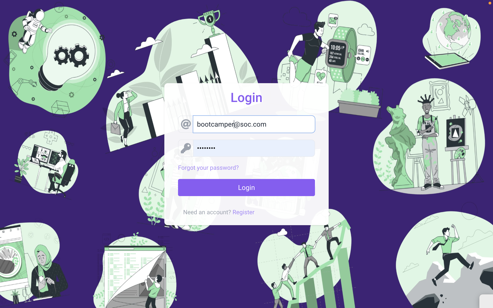
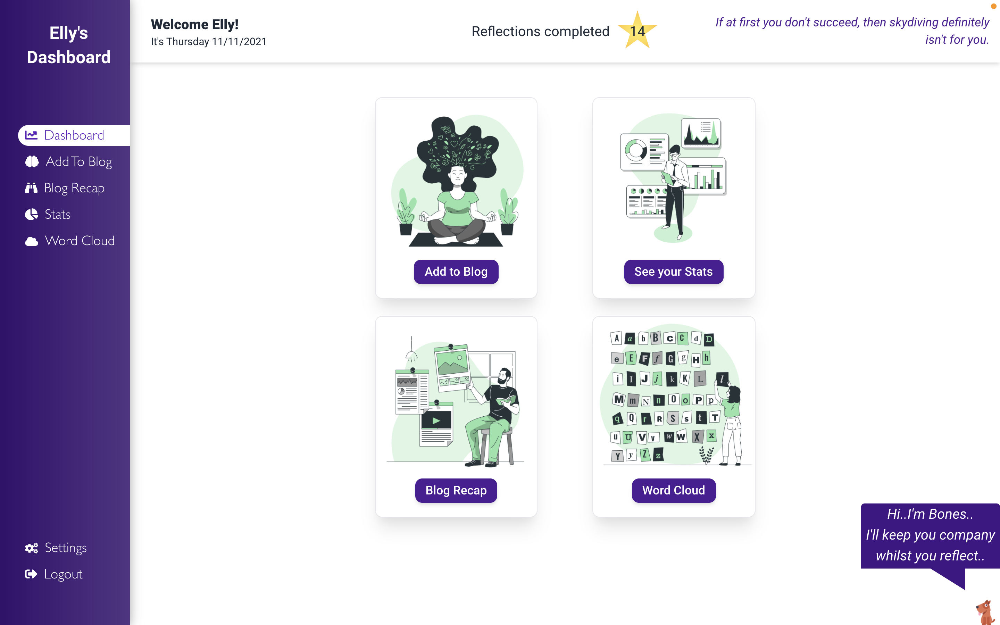
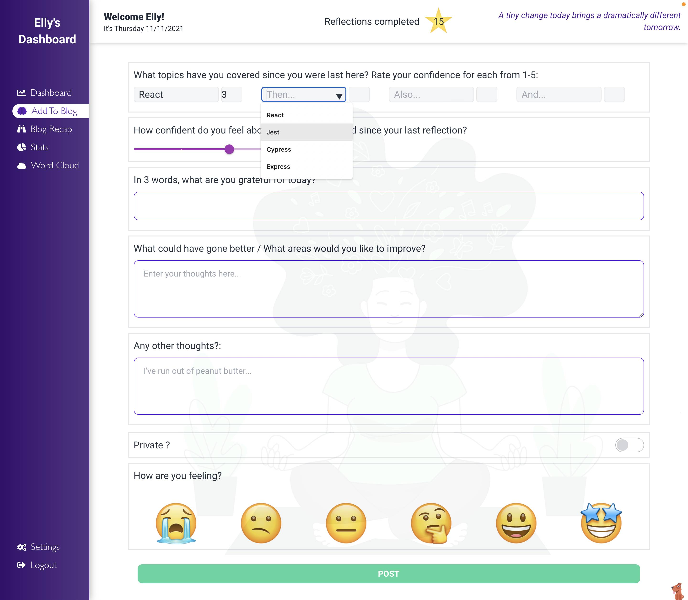
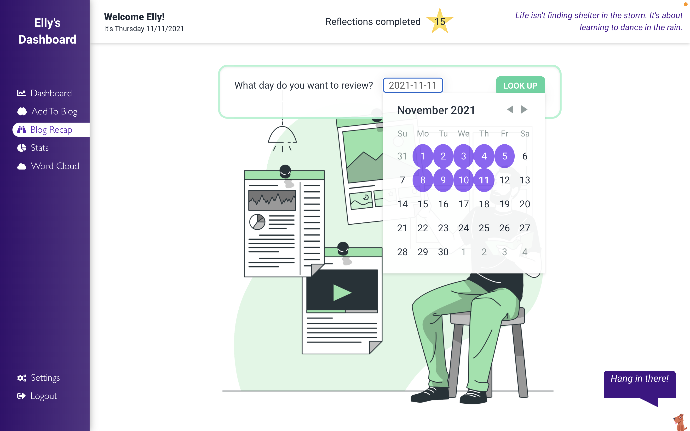
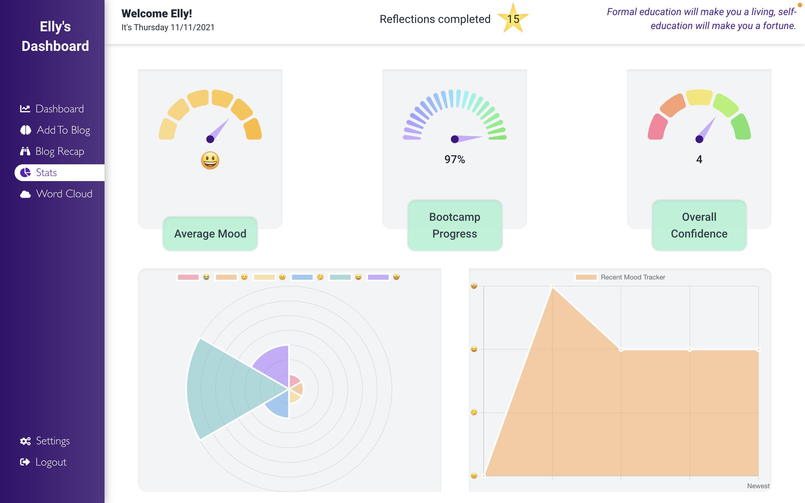
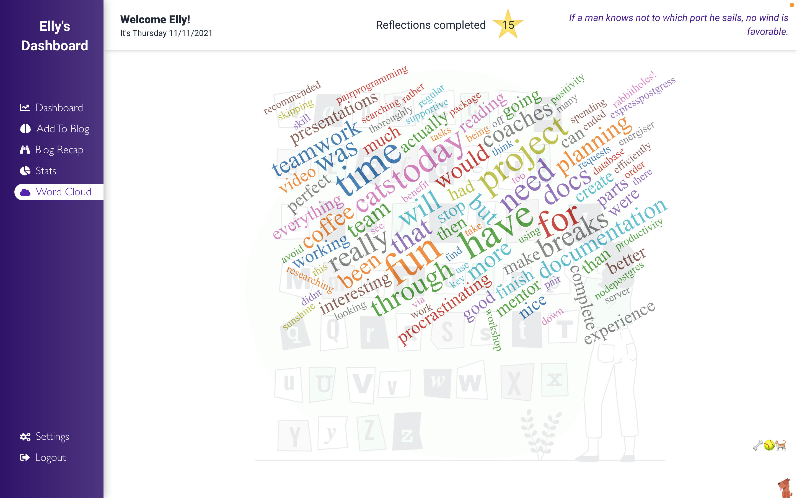
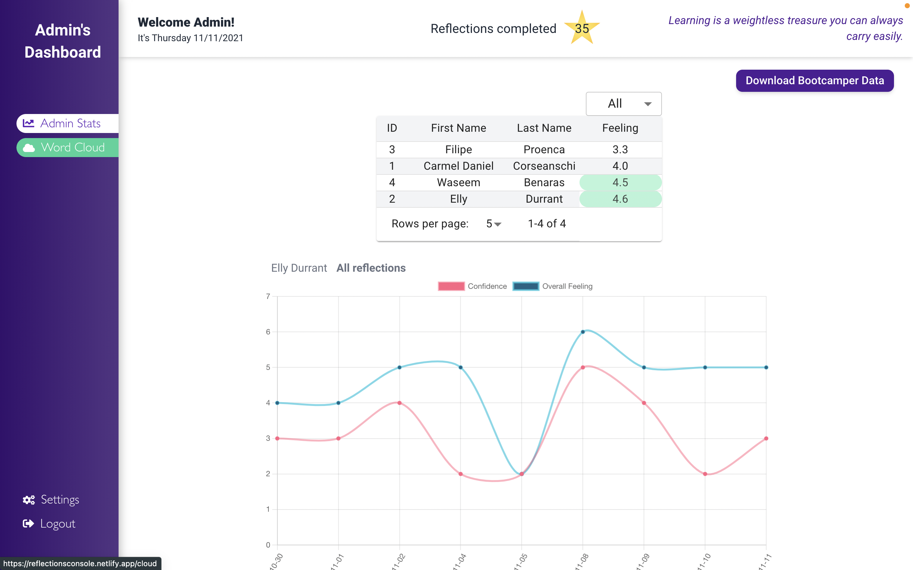
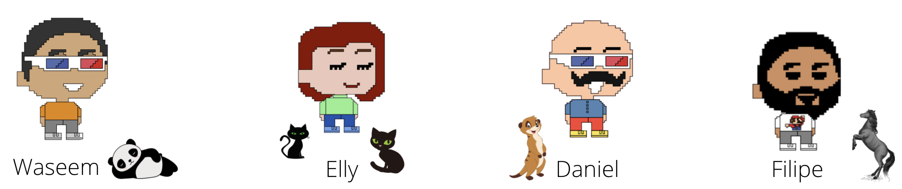

# Bootcamper Dashboard
## Team GlobalScope Final School of Code Project
November 2021 - 4 week project

---

### Problem Statement:
"Bootcampers do not have a way to easily record their journey and document their experience through the bootcamp."

---

### Current situation:
Bootcampers currently have no tools to structure the reflection process. They do not have access to previous reflections they have made, and disengage with the process.

---

### Why it's important:
The reflection process is an important aspect of learning and development, perhaps more so for bootcampers, who take part in such an intensive experience.
Not only can reflecting help develop an understanding of the way you learn, it can also help to promote critical thinking and problem solving, both of which are key skills to have as a developer.

---

### Our solution:
A dashboard application for bootcampers to be able to record and access their reflections in one convenient place. This includes features to encourage the bootcampers to engage.

Ability for the coaching staff to be able to access the data from the reflections in order to get a better understanding of how the bootcampers are feeling and progressing over the bootcamp.

---

## Project Details

### Tech Stack:

HTML5, CSS3, JavaScript, React, NodeJS, PostgreSQL, Express, MaterialUI, TailwindCSS, Chakra, DaisyUI, ChartJS, Jest, Cypress, React Testing Library, Figma, Jira, Confluence.

Cloud hosted using Heroku and Netlify.

---

### Link to the App

[Bootcamper Dashboard](https://reflectionsconsole.netlify.app/)

---

### How it looks:

---

---

---

---

## Meet the team

